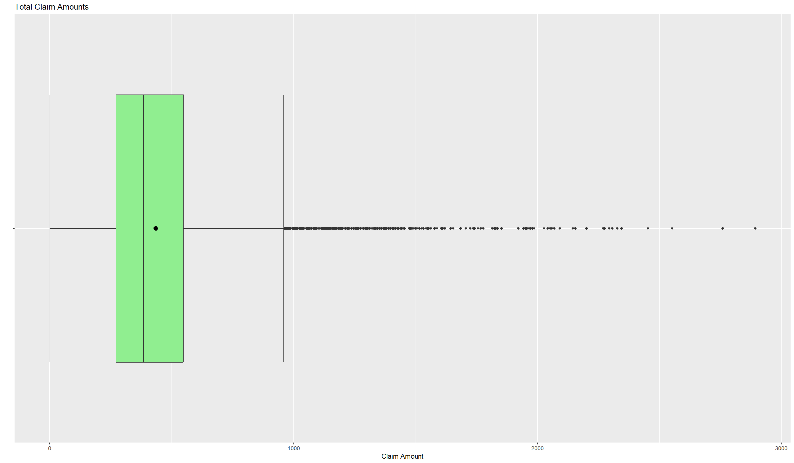
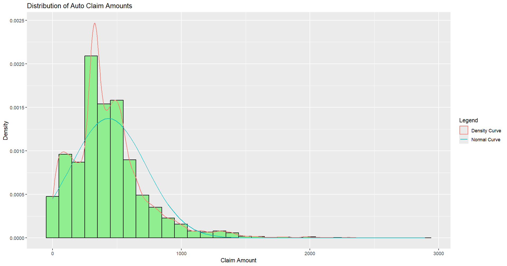

# Auto Insurance Cost Analysis
## Dataset:
* Kaggle: https://www.kaggle.com/datasets/ranja7/vehicle-insurance-customer-data 
## Objective:
I aim to study which variables impact the size of an auto insurance claim size.
## Research Questions
* How well does the driver’s profile (e.g. age, gender, etc.) predict charge size?
* Can the vehicle’s profile be used to predict charge size?
* Does geographic location relate to the charge size?
## Methodology and Data Cleaning:

* **Dropped Variables:** ‘Customer’, ‘Customer Lifetime Value’, ‘Effective to Date’, ‘Monthly Premium Auto’, ‘Months Since Last Claim’, ‘Months Since Policy Inception’, ‘Number of Open Complaints’, ‘Number of Policies’, ‘Renew Offer Type’, ‘Sales Channel’, ‘Policy Type’, ‘Policy’ 
* These variables do not provide information relevant to this project. Operational and administrative variables are excluded from the scope of this project.
## Overall Claim Distribution

* The claim amounts demonstrate a strong right-skew. The majority of claims are between ~$200 and ~$600. There are outliers as high as $2893.   
	* The average claim size is $434. The median claim size is $384.
* The large difference between the density curve and the normal curve suggest that the data set is not well approximated by a normal distribution.
