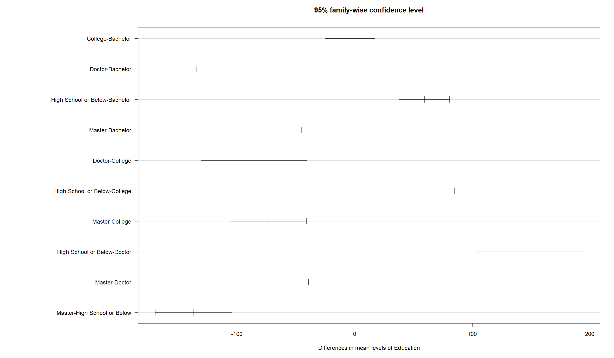
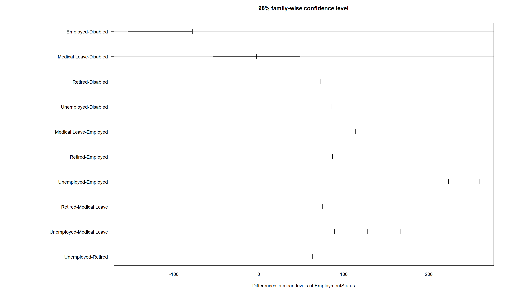
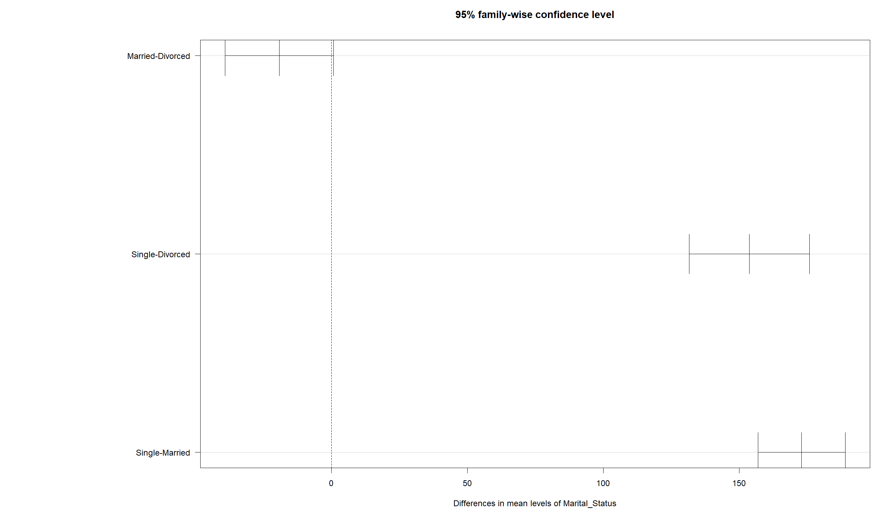
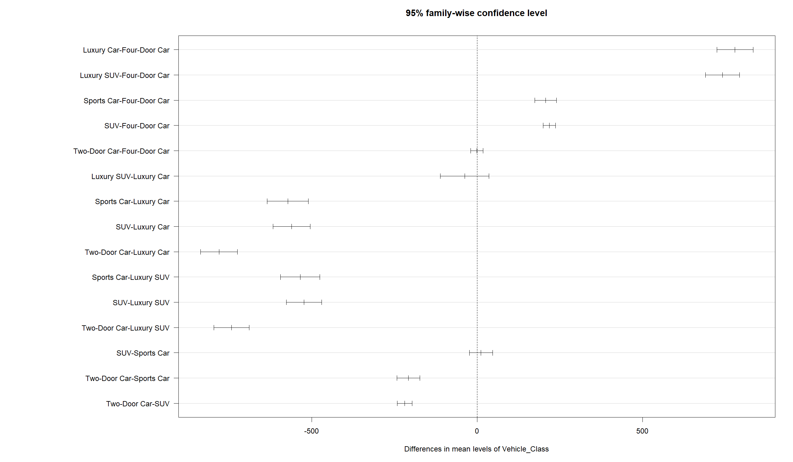
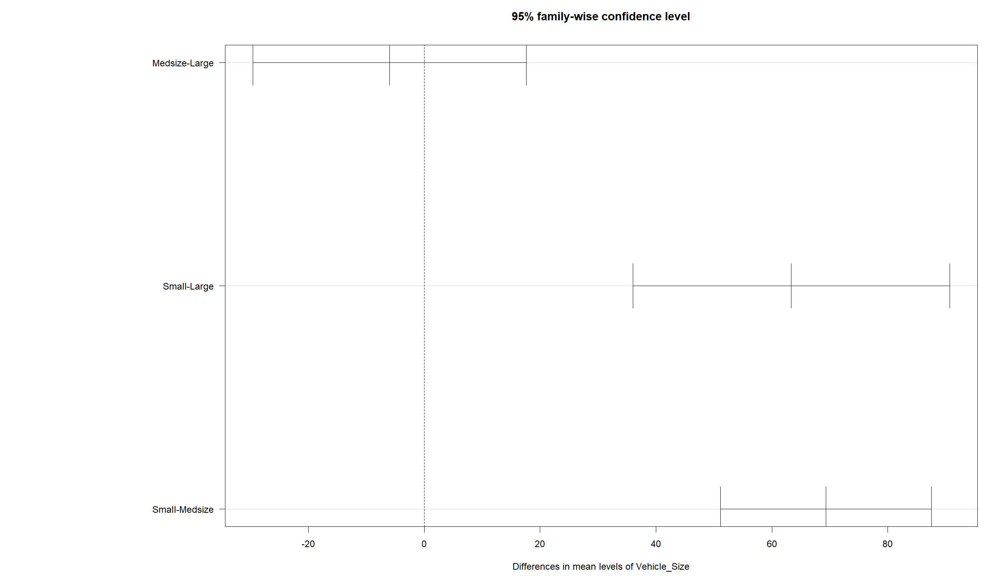
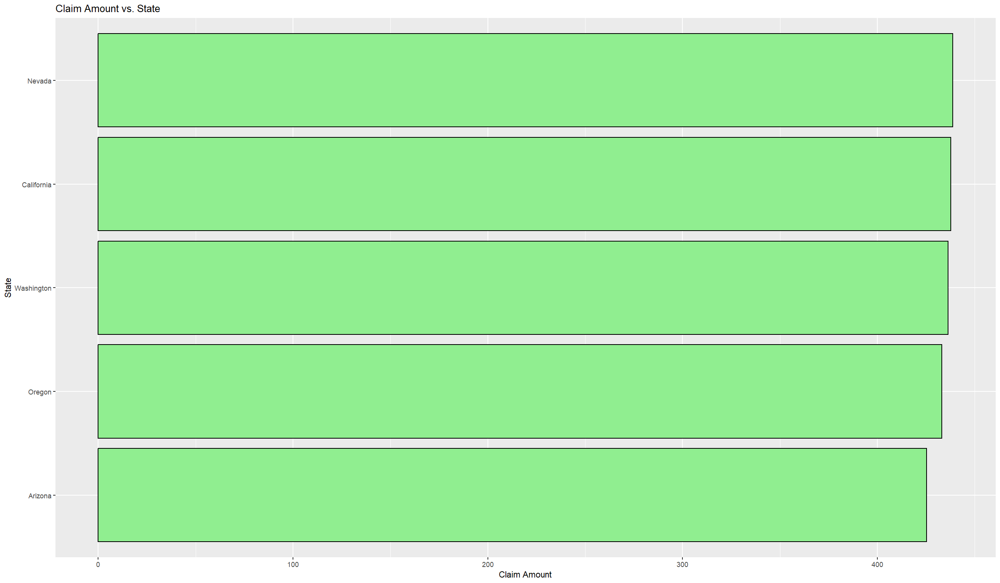
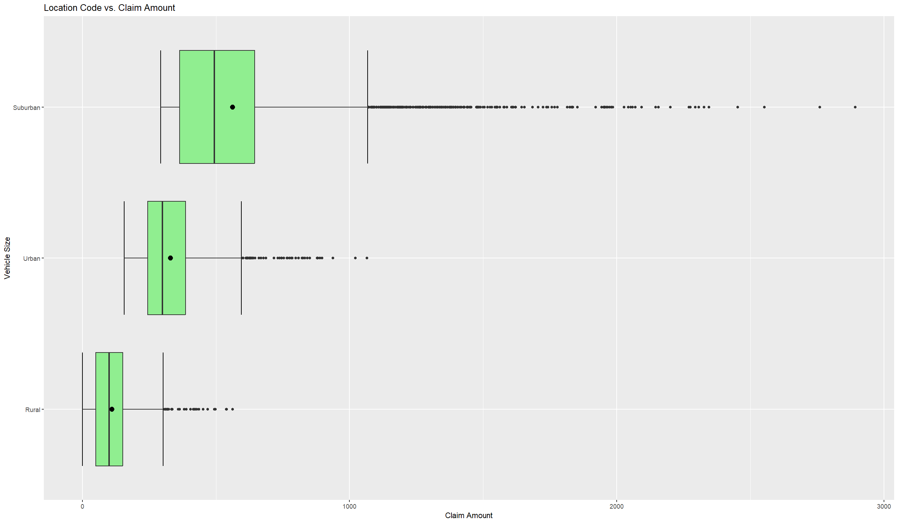
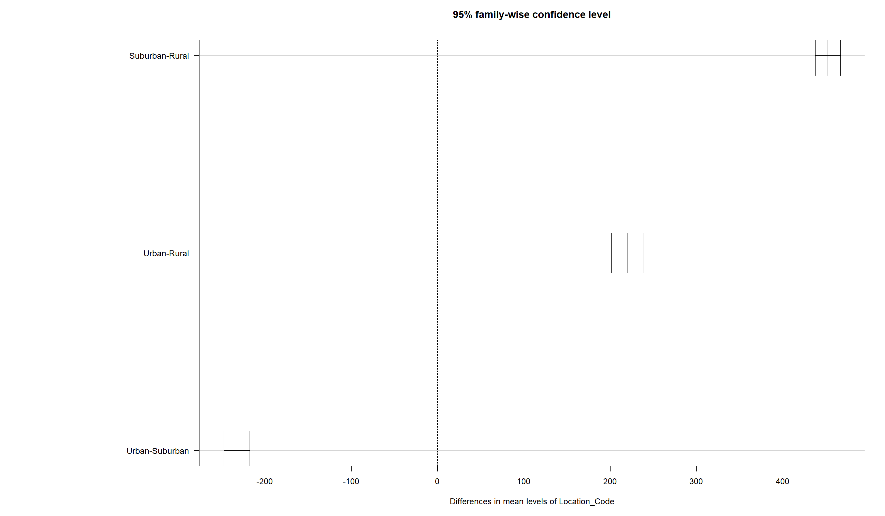

# Auto Insurance Cost Analysis
## Dataset:
* **Source:**[“Insurance: Vehicle insurance data of customers”]  (https://www.kaggle.com/datasets/ranja7/vehicle-insurance-customer-data)
* **Limitations:** 
* One unfortunate aspect of this dataset is that it does not include an age variable. 
* This dataset only contains claim severity, not claim frequency. Thus, I cannot calculate expected loss or build a pricing model.
## Objective:
I aim to study which variables impact the size of an auto insurance claim size.
## Research Questions
* **Individual:** How well does the driver’s profile (e.g. education, gender, etc.) predict charge size?
* **Vehicle:** Can the vehicle’s profile be used to predict charge size?
* **Location:** Does geographic location relate to the charge size?
## Methodology and Data Cleaning:
* For each variable, an initial, basic analysis will be conducted to observe the distribution.
* For each relevant variable, a one-way ANOVA will be used to determine whether the mean value of the “Total Claim Amount” variable differed across categorical groups. The null hypothesis assumes that all group means are equal, where the alternative hypothesis is that at least one group mean differs. 
	* We will reject the null hypothesis if the p value is less than 0.05.
	* We will fail to reject the null hypothesis if the p value is greater than or equal to 0.05.
* A TukeyHSD test will be done to determine which groups are significantly different from each other on the relevant variables.

* ** Dropped Variables: ** ‘Customer’, ‘Coverage’, ‘Customer Lifetime Value’, ‘Effective to Date’, ‘Monthly Premium Auto’, ‘Months Since Last Claim’, ‘Months Since Policy Inception’, ‘Number of Open Complaints’, ‘Number of Policies’, ‘Renew Offer Type’, ‘Sales Channel’, ‘Policy Type’, ‘Policy’, ‘Response’
* **Justification:** These variables do not provide information relevant to this project. Operational and administrative variables are excluded from the scope of this project.
## Overall Claim Distribution

* The claim amounts demonstrate a strong right-skew. The majority of claims are between ~$200 and ~$600. There are outliers as high as $2893.   
	* The average claim size is $434. The median claim size is $384.
* The large difference between the density curve and the normal curve suggest that the data set is not well approximated by a normal distribution.
---
## Individual Characteristics Analysis
### Gender 
#### Basic Analysis

* Males have a higher mean and median claim size than females. 
* Males have an average mean claim size of $456.18 and median claim size of $401.64. 
* Females have an average claim size of $412.86 and a median claim size of $364.31.
* Males have a higher standard deviation than females.
	* Males have a standard deviation of $303.37.
	* Females have a standard deviation of $275.94.
* Both Males and Females display a strong right-skew. 

#### ANOVA
* The ANOVA test was statistically significant (p = 9.67e-13), providing significant evidence that at least one group mean differs. For this variable, that means that the means of males and females are different in terms of their average claim amount.

### Education
#### Basic Analysis

* The average claim amount is lower for higher levels of education.
* Notably, doctorates have the fewest outliers.
	* This may be because doctors have the fewest number of individuals (342).
* All levels of education display some degree of right-skew.

#### ANOVA
* The ANOVA test was statistically significant (p = 2e-16), providing significant evidence that at least one group mean differs. For this variable, that means that at least one level of education is different in average claim amount.

* A TukeyHSD test revealed that there is a significant difference between all education pairs, except for college-bachelor (p = 0.984) and master-doctor (p = 0.968). Higher levels of education seem to have a significantly lower mean than lower levels of education. 

### Employment Status
#### Basic Analysis

* Unemployed individuals have the highest average claim size by far ($599.58). It is more than $100 higher than the second highest average claim size, Retired ($489.90).
* Retired claims have the lowest standard deviation despite having the lowest number of individuals. 
* All of the employment statuses display a positive skew.

#### ANOVA
* The ANOVA test was statistically significant (p = 2e-16), providing significant evidence that at least one group mean differs. For this variable, that means that at least one employment status is different in average claim amount.

* A TukeyHSD test revealed that the pairs that are not significantly different are medical leave-disabled (p = ~1.000), retired-disabled (p = 0.952), and retired-medical leave (p = 0.910). Interestingly, these three categories (medical leave, retired, and disabled) can  be described as individuals outside of the active workforce.

### Income
#### Basic Analysis

* There is a slight negative relationship between income and claim size.
	* This is not a reliable predictor, as suggested by the wide range of datapoints. 
* There is a large number of datapoints with an income roughly equal to 0. These are likely representing the unemployed and retired individuals. 

#### $R^2$ Analysis
* The $R^2$ value is 0.1261. This indicates that ~12.61% of the variance in the “Total Claim Amount” variable is explained by the income variable. 

### Marital Status
#### Basic Analysis

* The highest average marital status claim size is Single individuals ($557.41). This is notably higher than Divorced ($403.71) and Married ($384.52).
* Single individuals have the highest median and standard deviation, as well. 
* All three marital statuses display right-skew. 

#### ANOVA
* The ANOVA test was statistically significant (p = 2e-16), providing significant evidence that at least one group mean differs. For this variable, that means that at least one marital status is different in average claim amount.

* A TukeyHSD test revealed that the only pair that was not significantly different was married-divorced (p = 0.062). This suggests that the “single” group is significantly different from both married and divorced individuals in regard to auto insurance average claim size.
---
## Vehicle Characteristics Analysis
### Vehicle Class
#### Basic Analysis

* Tiers of Risk:
	* High Risk: Luxury Cars and Luxury SUVs have medians and means **above $1000**.
	* Moderate Risk: SUV’s and Sport Cars have a mean claim size of **$500 - $600**.
	* Low Risk: Two-Door Cars and Four-Door Cars have a mean claim size of **~$350**.
* All of the vehicle classes display a positive skew. 
* Luxury vehicles display the widest IQRs. 

#### ANOVA
* The ANOVA test was statistically significant (p = 2e-16), providing significant evidence that at least one group mean differs. For this variable, that means that at least one vehicle class is different in average claim amount.

* A TukeyHSD test reveals that the only pairs that do not display a significant difference are two-door car-four door car (p = 1.000), luxury SUV-luxury car (p = 0.689), and SUV-Sports-car (p = 0.939). Each of these pairs would be expected to have similar prices and risk profiles, which could be an explanation for their lack of significant differences.  

### Vehicle Size 
#### Basic Analysis

* Large and Medsize vehicles display a similar distribution. 
* Small vehicles have a larger mean and median.
* They are all right-skewed.

#### ANOVA
* The ANOVA test was statistically significant (p = 2e-16), providing significant evidence that at least one group mean differs. For this variable, that means that at least one vehicle size is different in average claim amount.

* A TukeyHSD test revealed that the only pair that did not display a significant difference in mean is Medsize-Large (p = 0.823). This is explained by the similarities between medium-sized vehicles and large vehicles that are not shared with small vehicles (e.g. parts pricing, safety levels, etc.).
---
## Location Characteristics Analysis
### State
#### Basic Analysis

* **Note:** In this dataset, only claims from Arizona, California, Nevada, Oregon, and Washington are included.
* All of these states have a similar mean claim amount (**~$430**).
* There does not seem to be much difference between states.

#### ANOVA
* The ANOVA test was not statistically significant (p = 0.669), providing insufficient evidence that at least one group mean differs. For this variable, that means that there is no significant difference in average claim amount between states.
	* This makes sense given that each state will have roughly similar makeup of cars and drivers. The law of large numbers will average out the claim sizes.

### Location Code

* There are notable differences between different location code claim amounts.
	* **Rural:** Mean: $109.51; Median: $100.05; St Dev: $76.85
	* **Suburban:** Mean: $562.16; Median: $494.40; St Dev: $275.17
	* **Urban:** Mean: $329.57; Median: $300.06; St Dev: $124.18
* They are all strongly right-skewed.

#### ANOVA
* The ANOVA test was statistically significant (p = 2e-16), providing significant evidence that at least one group mean differs. For this variable, that means that at least one location code is different in average claim amount.

* A TukeyHSD test reveals that all of the pairs have a significant difference. This can be explained by the difference in driving conditions and demographics that will be present in the different locations.

