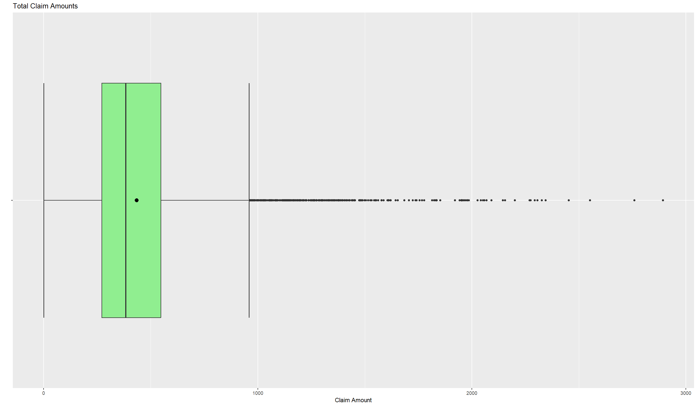
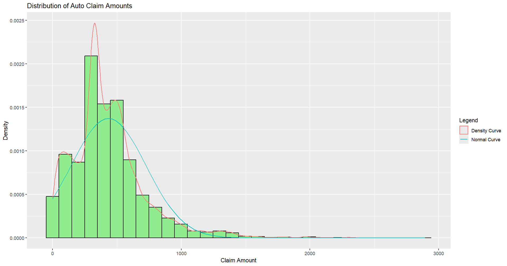
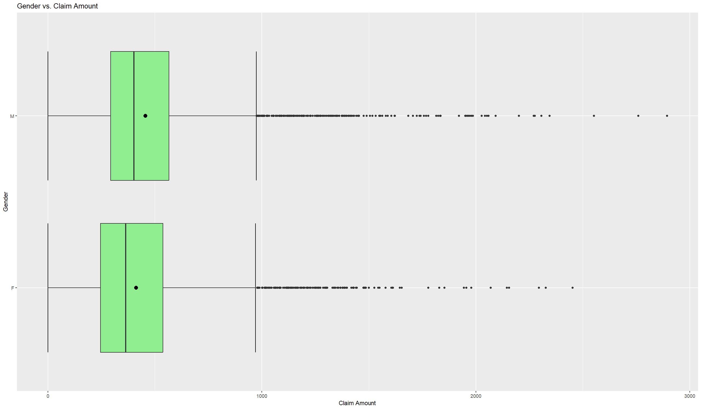
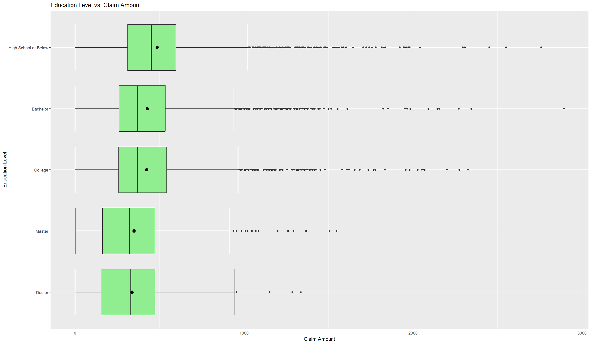
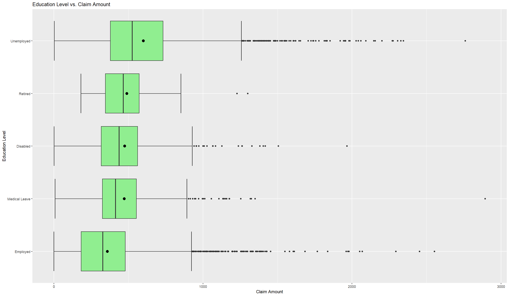
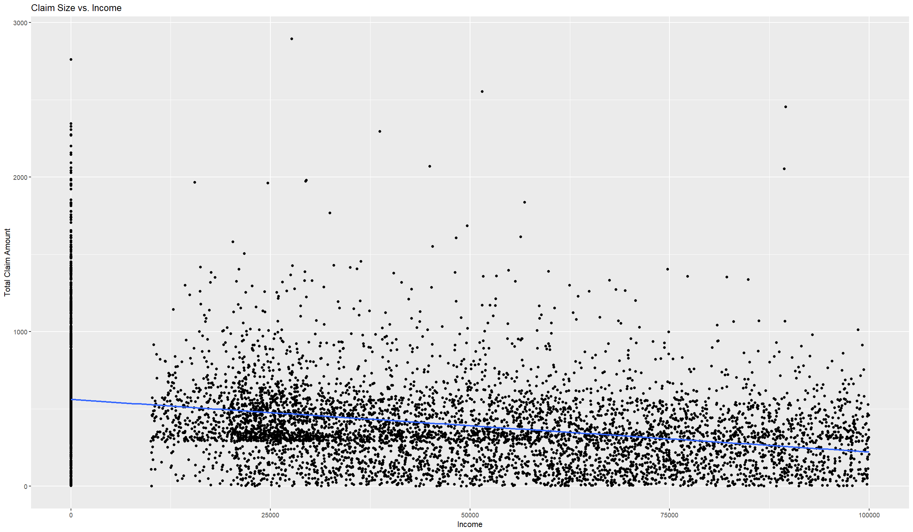
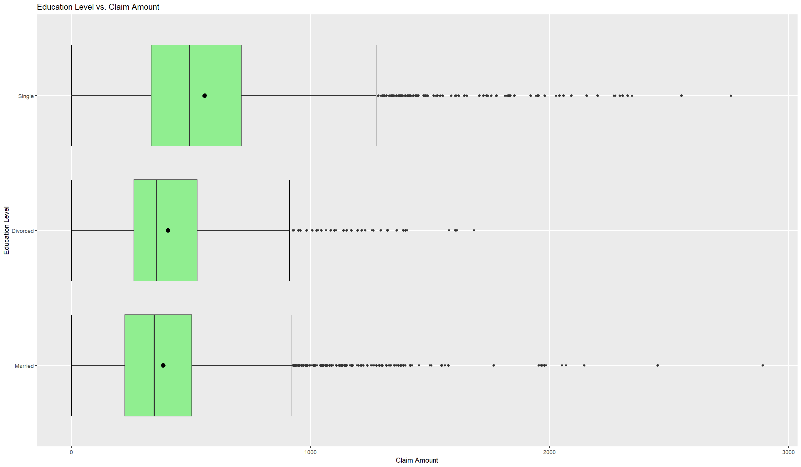
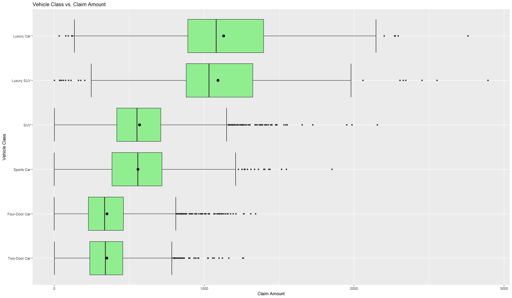
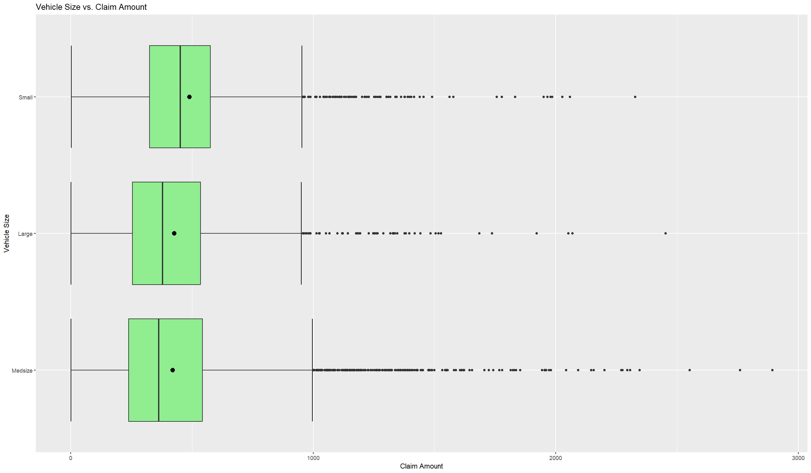

# Auto Insurance Cost Analysis
## Dataset:
* **Source:**[“Insurance: Vehicle insurance data of customers”]  (https://www.kaggle.com/datasets/ranja7/vehicle-insurance-customer-data)
* **Limitations:** 
	* One unfortunate aspect of this dataset is that it does not include an age variable. 
	* This dataset only contains claim severity, not claim frequency. Thus, I cannot calculate expected loss or build a pricing model.
## Objective:
I aim to study which variables impact the size of an auto insurance claim size.
## Research Questions
* **Individual:** How well does the driver’s profile (e.g. education, gender, etc.) predict charge size?
* **Vehicle:** Can the vehicle’s profile be used to predict charge size?
* **Location:** Does geographic location relate to the charge size?
## Methodology and Data Cleaning:

* ** Dropped Variables: ** ‘Customer’, ‘Coverage’, ‘Customer Lifetime Value’, ‘Effective to Date’, ‘Monthly Premium Auto’, ‘Months Since Last Claim’, ‘Months Since Policy Inception’, ‘Number of Open Complaints’, ‘Number of Policies’, ‘Renew Offer Type’, ‘Sales Channel’, ‘Policy Type’, ‘Policy’, ‘Response’
* **Justification:** These variables do not provide information relevant to this project. Operational and administrative variables are excluded from the scope of this project.
## Overall Claim Distribution

* The claim amounts demonstrate a strong right-skew. The majority of claims are between ~$200 and ~$600. There are outliers as high as $2893.   
	* The average claim size is $434. The median claim size is $384.
* The large difference between the density curve and the normal curve suggest that the data set is not well approximated by a normal distribution.
---
## Individual Characteristics Analysis
### Gender 

* Males have a higher mean and median claim size than females. 
* Males have an average mean claim size of $456.18 and median claim size of $401.64. 
* Females have an average claim size of $412.86 and a median claim size of $364.31.
* Males have a higher standard deviation than females.
	* Males have a standard deviation of $303.37.
	* Females have a standard deviation of $275.94.
* Both Males and Females display a strong right-skew. 
### Education

* The average claim amount is lower for higher levels of education.
* Notably, doctorates have the fewest outliers.
	* This may be because doctors have the fewest number of individuals (342).
* All levels of education display some degree of right-skew.
### Employment Status

* Unemployed individuals have the highest average claim size by far ($599.58). It is more than $100 higher than the second highest average claim size, Retired ($489.90).
* Retired claims have the lowest standard deviation despite having the lowest number of individuals. 
* All of the employment statuses display a positive skew.
### Income

* There is a slight negative relationship between income and claim size.
	* This is not a reliable predictor, as suggested by the wide range of datapoints. 
* There is a large number of datapoints with an income roughly equal to 0. These are likely representing the unemployed and retired individuals. 
### Marital Status

* The highest average marital status claim size is Single individuals ($557.41). This is notably higher than Divorced ($403.71) and Married ($384.52).
* Single individuals have the highest median and standard deviation, as well. 
* All three marital statuses display right-skew. 
---
## Vehicle Characteristics Analysis
### Vehicle Class

* Tiers of Risk:
	* High Risk: Luxury Cars and Luxury SUVs have medians and means **above $1000**.
	* Moderate Risk: SUV’s and Sport Cars have a mean claim size of **$500 - $600**.
	* Low Risk: Two-Door Cars and Four-Door Cars have a mean claim size of **~$350**.
* All of the vehicle classes display a positive skew. 
* Luxury vehicles display the widest IQRs. 
### Vehicle Size 

* Large and Medsize vehicles display a similar distribution. 
* Small vehicles have a larger mean and median.
* They are all right-skewed.
---
## Location Characteristics Analysis

